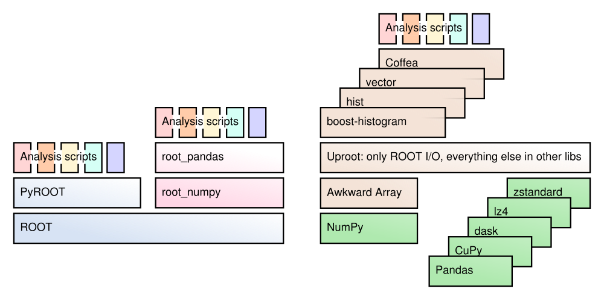

[](https://scikit-hep.org/)
[](https://nsf.gov/awardsearch/showAward?AWD_ID=1836650)
[](https://doi.org/10.5281/zenodo.3952728)
[](https://www.python.org)
[](https://opensource.org/licenses/BSD-3-Clause)

Uproot is a reader and a writer of the [ROOT file format](https://root.cern/) using only Python and Numpy. Unlike the standard C++ ROOT implementation, Uproot is only an I/O library, primarily intended to stream data into machine learning libraries in Python. Unlike PyROOT and root_numpy, uproot does not depend on C++ ROOT. Instead, it uses Numpy to cast blocks of data from the ROOT file as Numpy arrays.

<p align="center"></p>

# Installation

Uproot can be installed [from PyPI](https://pypi.org/project/uproot4) using pip ([awkward1](https://pypi.org/project/awkward1) is optional but highly recommended):

```bash
pip install uproot4 awkward1
```

Uproot is also available using [conda](https://anaconda.org/conda-forge/uproot4) (so is [awkward1](https://anaconda.org/conda-forge/awkward1), which conda installs automatically):

```bash
conda install -c conda-forge uproot4
```

If you have already added `conda-forge` as a channel, the `-c conda-forge` is unnecessary. Adding the channel is recommended because it ensures that all of your packages use compatible versions:

```bash
conda config --add channels conda-forge
conda update --all
```

## Getting help

**Start with the [tutorials and reference documentation](https://uproot4.readthedocs.io/).**

   * Report bugs, request features, and ask for additional documentation on [GitHub Issues](https://github.com/scikit-hep/uproot4/issues).
   * If you have a "How do I...?" question, ask about it on [StackOverflow with the [uproot] tag](https://stackoverflow.com/questions/tagged/uproot). Be sure to include tags for any other libraries that you use, such as Pandas or PyTorch.
   * To ask questions in real time, try the Gitter [Scikit-HEP/uproot](https://gitter.im/Scikit-HEP/uproot) chat room.

## Installation for developers

Uproot is an ordinary Python library; you can get a copy of the code with

```bash
git clone https://github.com/scikit-hep/uproot4.git
```

and install it locally by calling `pip install .` in the repository directory.

If you need to develop Awkward Array as well, see its [installation for developers](https://github.com/scikit-hep/awkward-1.0#installation-for-developers).

# Dependencies

**Uproot's only strict dependency is NumPy.** This is the only dependency that pip will automatically install.

**Awkward Array is highly recommended.** It is not a strict dependency to allow Uproot to be used in highly restrictive environments. If you're using Uproot without Awkward Array, you'll have to use the `library="np"` option to return arrays as NumPy arrays (see documentation).

   * `awkward1`: be sure to use Awkward Array 1.x.

The following libraries are also useful in conjunction with Uproot, but are not necessary. If you call a function that needs one, you'll be prompted to install it. (Conda installs most of these automatically.)

**For ROOT files, compressed different ways:**

   * `lz4` and `xxhash`: only if reading ROOT files that have been LZ4-compressed.
   * `zstandard`: only if reading ROOT files that have been ZSTD-compressed.
   * `backports.lzma`: only if reading ROOT files that have been LZMA-compressed (in Python 2).

**For remote data:**

   * `xrootd`: only if reading files with `root://` URLs.

**For exporting data to other libraries:**

   * `pandas`: only if `library="pd"`.
   * `cupy`: only if `library="cp"` (reads arrays onto GPUs).
   * `boost-histogram`: only if converting histograms to [boost-histogram](https://github.com/scikit-hep/boost-histogram) with `histogram.to_boost()`.
   * `hist`: only if converting histograms to [hist](https://github.com/scikit-hep/hist) with `histogram.to_hist()`.

# Acknowledgements

Support for this work was provided by NSF cooperative agreement OAC-1836650 (IRIS-HEP), grant OAC-1450377 (DIANA/HEP) and PHY-1520942 (US-CMS LHC Ops).

Thanks especially to the gracious help of awkward-array contributors (including the [original repository](https://github.com/scikit-hep/uproot)).
