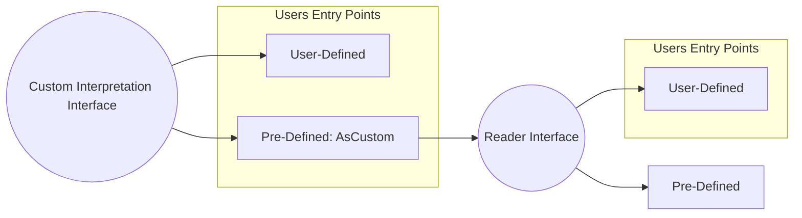
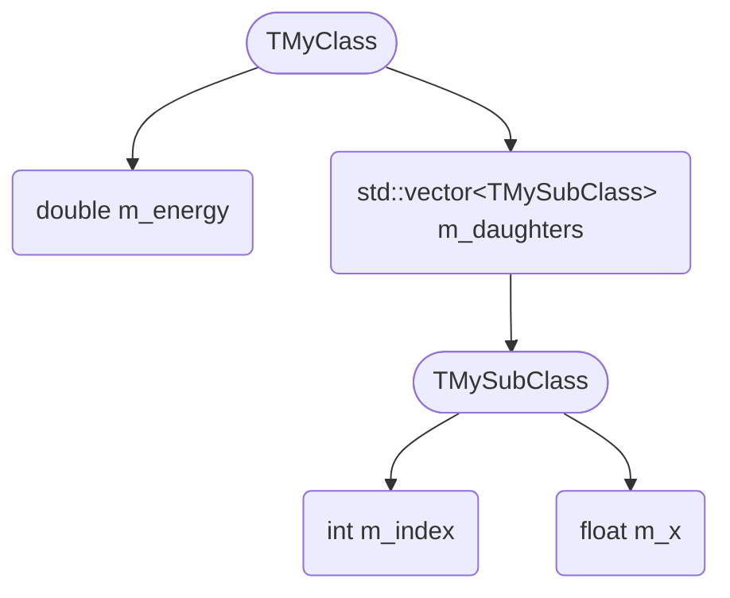
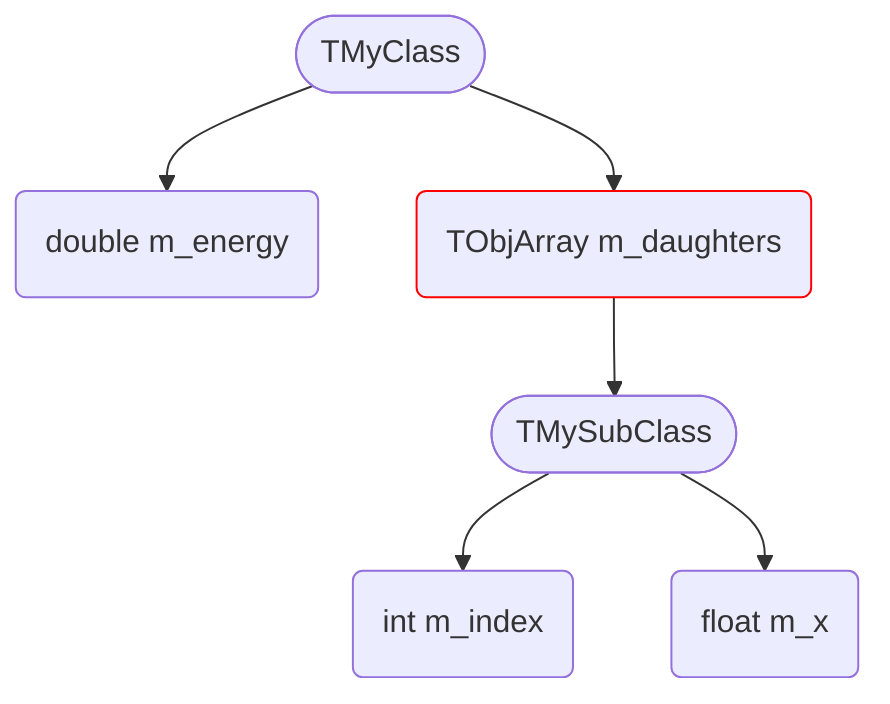
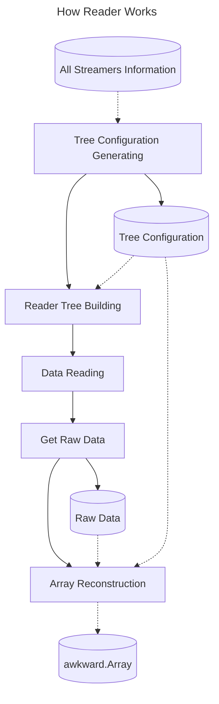
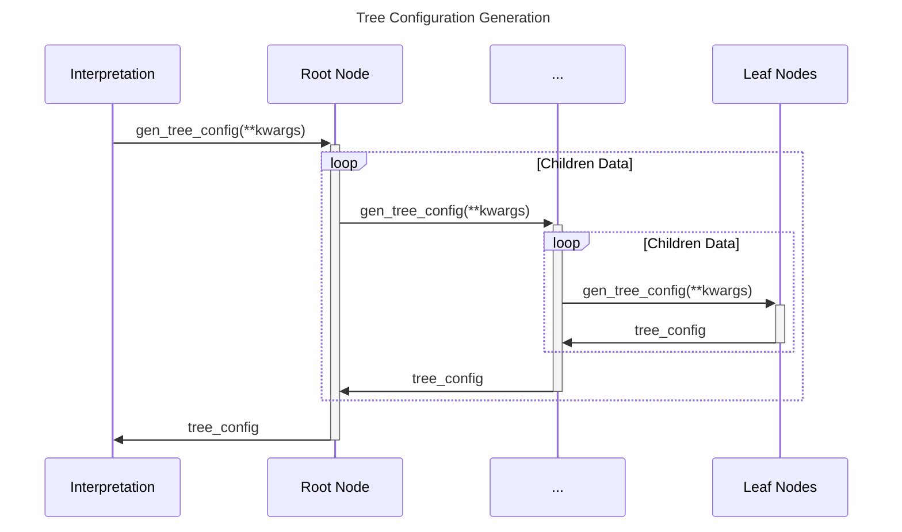
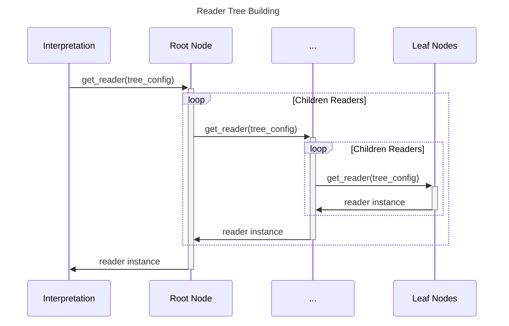
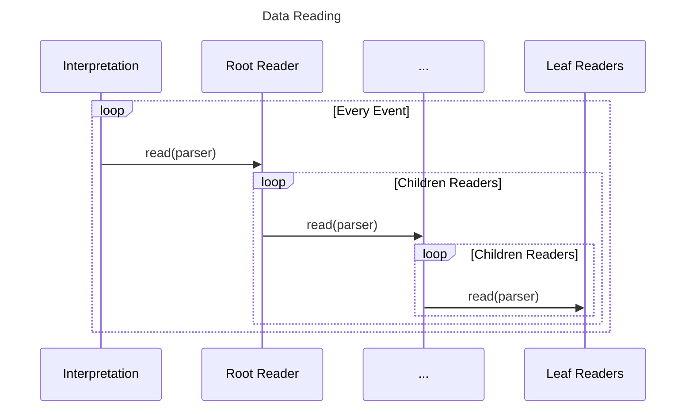
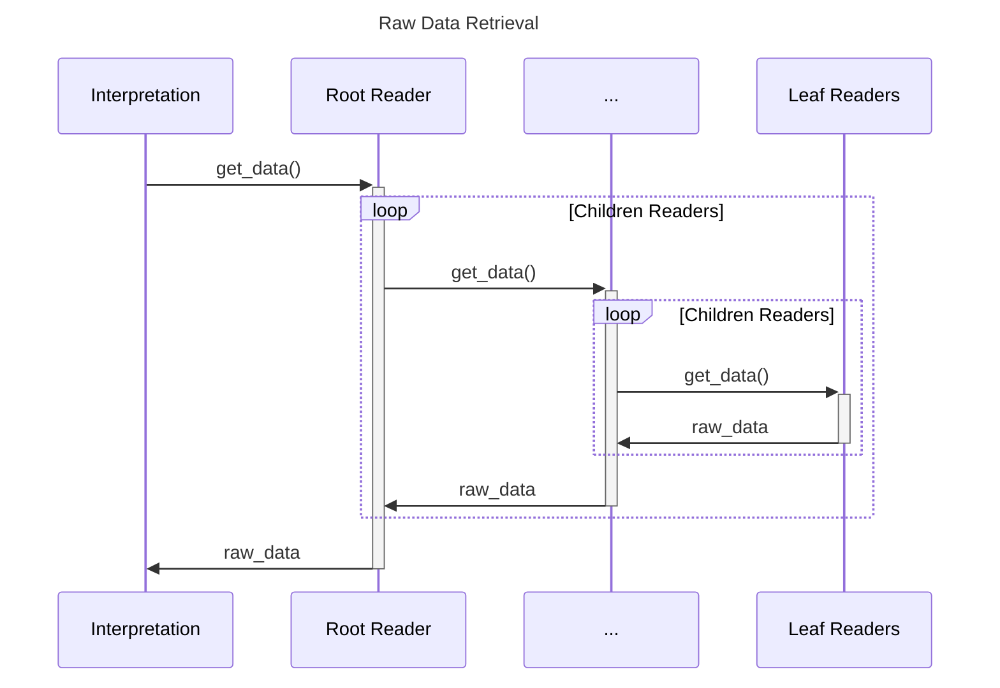
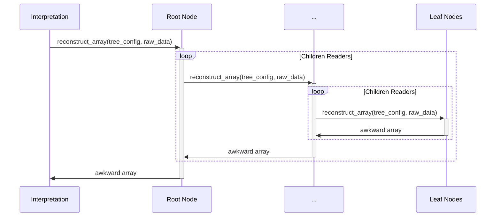
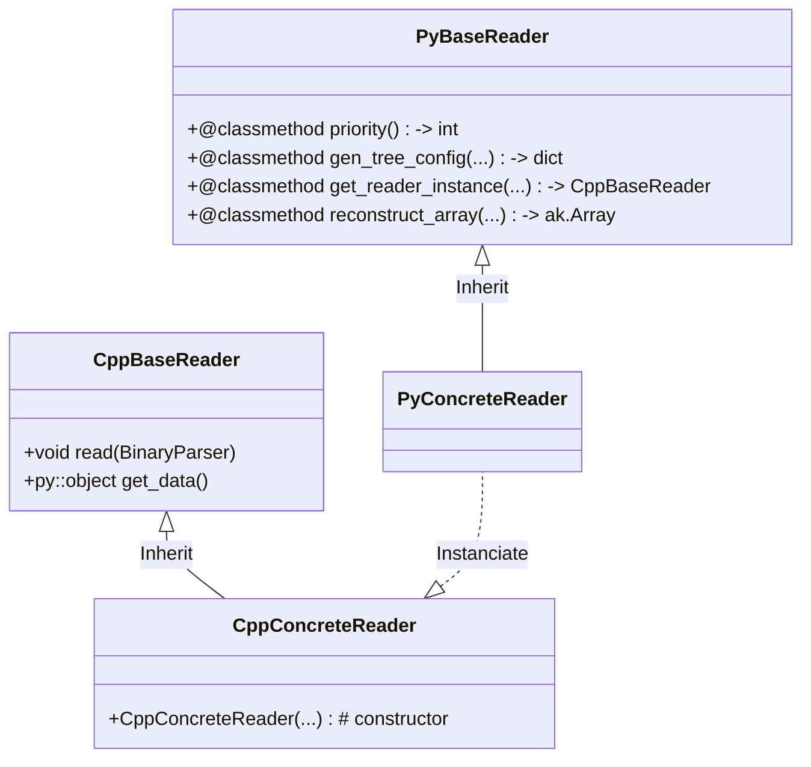

# Draft of "Custom Interpretation"

## 1 Overview

To read BES3 data via `uproot`, I implemented a custom interpretation and successfully converted BES3 custom classes to `awkward.Array` ([`pybes3`](https://pybes3.readthedocs.io/en/latest/user-manual/bes3-data-reading)). During this work, I found that it seems possible for `uproot` to provide a more general interface for user-defined interpretation, and even provide a general custom-class reading mechanism.

In this draft, I illustrated some ideas and designs I have in mind, which may be useful for `uproot` to improve the functionality of custom-class reading.

In [Custom-Interpretation Interface](#2-custom-interpretation-interface), I simply illustrated how `uproot` provides a custom interpretation interface. In [Reader Interface](#3-reader-interface), I introduced a new interface called `Reader`, which can save users a lot of work when implementing custom interpretation.

For users, one can choose different entry points to read their custom classes:

* Directly use pre-defined interpretation `AsCustom`: `AsCustom` uses pre-defined `Reader` classes to read custom classes. No extra work is needed for users. See [AsCustom](#31-pre-defined-interpretation-ascustom).
* Define custom `Reader`: This is a relatively simple way to implement custom reading rules. There is no need for users to implement a new interpretation, but only need to implement a few custom `Reader` classes.
* Define custom `Interpretation`: This is the most general way, but it is also the most complex way.



## 2 Custom-Interpretation Interface

A base class for custom interpretation is defined in `uproot.interpretation.custom.CustomInterpretation`. Several methods are defined in this class (`cache_key`, `typename`, `final_array`, etc), but there are still some methods that need to be implemented by users (`match_branch`, `basket_array`, etc).

### 2.1 Identification

There is only one extra method is defined in `CustomInterpretation`: `match_branch`. This method tells `uproot` whether a branch should be applied with custom interpretation or not. `match_branch` receives the arguments given to `uproot.interpretation.identify.interpretation_of`, and should return `True` if the branch matches the custom interpretation, otherwise return `False`.

When opening a new branch, method `uproot.interpretation.identify.interpretation_of` will loop each registered interpretation class and call its `match_branch` method. If `match_branch` returns `True`, this interpretation will be instanciated and applied to the branch.

### 2.2 Pre-defined Interpretation "AsBinary"

This interpretation is designed to directly read out the raw binary data for developing and debugging. It can be used as:

```python
binary_data = my_branch.array(interpretation=AsBinary())
```

See `uproot.interpretation.custom.AsBinary` for more details.

## 3 Reader Interface

### 3.1 Pre-defined Interpretation "AsCustom"

Even though `uproot` can provide a general interface for user-defined interpretation, it is still difficult for users to convert custom classes to `awkward.Array` from zero. In my consideration, `uproot` should provide more functionality beyond just an interface. During the implementation of `pybes3`, I found that there are only a few things that need to be customized for users. Most of the time, the reading process is still following the standard ROOT parsing rules.

Therefore, I designed an interpretation class `AsCustom`, and a new layer of interface, the `Reader`, to help users convert custom classes to `awkward.Array`. With `uproot` provided `AsCustom` interpretation and a series of pre-defined `Reader` classes, users can focus on implementing the custom rules for their own data format, instead of handling the whole reading process.

`AsCustom` has a class property `target_branches: set[str]` to specify which branches should be applied with custom interpretation. Users can set this property to a set of full branch paths.

A method `regularize_object_path` is defined (though there is another method `regularize_object_path` in `uproot/_util.py`) to remove suffix `;N` of the TTree object path. This method can help users to get the correct object path when using `AsCustom` interpretation.

### 3.2 Usage Scenario

For custom classes, data is stored in a tree structure, all streaming information can be accessed via `some_branch.file.streamers` in `uproot`. When some custom rules are applied to the tree structure, they are actually applied on only a few nodes of the tree most of the time. This means that for user, it is sufficient to implement the custom rules only for those nodes, while the rest of the tree can be left unchanged.

For example, when a custom class is defined as:

```c++
class TMySubClass : public TObject {
    int m_index;
    float m_x;
};

class TMyClass : public TObject {
    double m_energy;
    std::vector<MySubClass> m_daughters;
};
```

The data tree for `TMyClass` could be:



While when `std::vector` is replaced with `TObjArray`, but still storing `TMySubClass` objects (`TObjArray` is desined for storing any kinds of objects), the definition and data tree would be:

```c++
class TMyClass : public TObject {
    double m_double;
    TObjArray m_obj_array; // still stores TMySubClass
};
```



In this case, the user would only need to implement the custom rule for that `TObjArray` node, leaving other nodes unchanged.

### 3.3 Reader

The structure of "data tree" is so similar to that of `awkward` array, that we can just keep unflattening and zipping data from the leaf nodes to the root node. Basing on this, I defined `Reader` to act as a "data tree" node.

To read out a "data tree", we can loop over all nodes on the tree, select a proper `Reader` class for each node, and combine readers into a "reader tree".

The leaves of the reader tree should always be basic types readers, such as `CTypeReader<T>` where `T` is a basic type like `int`, `float`, etc. The internal and root nodes of the reader tree should be a kind of wrapper, like `STLSequenceReader`, `STLMapReader`, `ObjectReader`, which possess and handle some children readers.

Basic types readers alway return a 1D array of the data they read. For wrapper readers, while wrapper readers mostly control their children readers to read data in a correct order, and sometimes record information about the array structure, such as the number of elements in a `std::vector` for `STLSequenceReader`.

Basing on this consideration, I designed 5 procedures using `Reader` to convert custom classes to `awkward.Array`:
1. **Tree Configuration Generation**: Generate a tree configuration that describes the tree structure of the data.
2. **Reader Tree Building (In Python)**: Build a reader tree according to the tree configuration.
3. **Data Reading (In C++)**: Read data from the binary data stream using the reader tree.
4. **Raw Data Retrieval (From C++ to Python)**: Retrieve raw data from the reader tree.
5. **Array Reconstruction (In Python)**: Reconstruct the raw data into `awkward.Array` using the tree configuration.



Below I will illustrate how `Reader` works in detail.

#### 3.3.1 Tree Configuration Generation (In Python)

Since reading process should be implemented in C++, the tree configuration is a bridge between the building reader tree and reconstructing data arrays. It is a nested `dict`, generated by looping streamer information recursively. In the tree configuration, each node is represented as a dictionary, which contains:

* `reader`: Which `Reader` class to use for this node.
* `name`: The name of the node.
* Other information needed for constructing `Reader` class, such as:
    * `ctype` (for `CTypeReader`): The value type to be read, for example, `int`, `float`, `double`, etc.
    * `element_reader` (for `STLSequenceReader`): The configuration dictionary of the element reader.
    * `sub_readers` (for `ObjectReader`): A list of configuration dictionaries of the sub-readers.
    * ...



An example of tree configuration is:

```python
{
    "reader": "ObjectReader",
    "name": "TMyClass",
    "sub_readers": [
        {
            "reader": "CTypeReader",
            "name": "m_double",
            "ctype": "double"
        },
        {
            "reader": "STLSequenceReader",
            "name": "m_data",
            "element_reader": {
                "reader": "CTypeReader",
                "name": "element"
                "ctype": "int",
            }
        }
    ]
}
```

#### 3.3.2 Reader Tree Building (In Python)

After generating a tree configuration, we can build a reader tree. All readers are instanciated according to nodes in the tree configuration. Children readers are instanciated first, and then passed to their parent reader as constructor argument. This procedure can combine all readers into a tree structure either in Python or C++.




#### 3.3.3 Data Reading & Raw Data Retrieval (In C++)

Once the reader tree is built, a `BinaryParser` object will be instanciated with the binary data and byte-offsets. Then, the `read` method of the root reader  will be called `n-evt` times to read data from the binary data stream, where `n-evt` is the number of events in the binary data. The root reader will call its children readers recursively to read data.

Once the reading process finished, `get_data` method of the root reader will be called, recursively calling the `get_data` method of its children readers to retrieve data they read. Readers at the leaves of the reader tree returns an numpy array of what they read, while readers at the internal nodes return a tuple packaging their children readers' data and their own data together (e.g. `STLSequenceReader` returns `(counts, element_raw_data)` where `counts` is the number of elements in each call of `read` and `element_raw_data` is the raw data read by its children reader).

I don't directly return an `awkward.Array` from the `get_data` method, since the reading process should be implemented in C++. Though directly returning `awkward.Array` in C++ is possible, for users who want to do more complex things, Python is more flexible.





#### 3.3.4 Array Reconstruction (In Python)

By calling `get_data` method of the root reader, we can get a nested raw data only containing `tuple` and numpy arrays. The next step is to reconstruct those numpy arrays into `awkward.Array`. This process is irrelevant to the reader tree instance, since they work in C++, and this is why we need "tree configuration" to bridge the reader tree and the reconstruction process.

Array reconstruction is done by calling `reconstruct_array` method. There are mostly 3 behaviors in this method:

* Directly return a numpy array (e.g. `CTypeReader`)
* Call `awkward.unflatten` to "unflatten" an array coming from children readers (e.g. `STLSequenceReader`)
* Call `awkwar.zip` to combine arrays coming from children readers (e.g. `ObjectReader`)

In expectation, the root reader will return an `awkward.Array` containing the whole data.



### 3.4 Registration Mechanism of Readers

A registration mechanism is designed to allow users to register their custom readers: `AsCustom` maintains a set of registered reader classes, and will loop over them in procedure [tree-configuration-generation](#331-tree-configuration-generation-in-python), [reader-tree-building](#332-reader-tree-building-in-python) and [array-reconstruction](#334-array-reconstruction-in-python).

Take "tree-configuration-generation" as an example, the main `gen_tree_config` function loops over each registered reader and call its `gen_tree_config` method. Once any reader returns a non-`None` value, the loop will break and return that configuration. The `Reader.priority` method is used to sort the registered readers, so that specific reader can be called first.

Here is a simplified version of `gen_tree_config`:

```python
def gen_tree_config(
    cls_streamer_info: dict,
    all_streamer_info: dict,
    item_path: str = "",
) -> dict:
    # Some helper variables to identify node location
    ...

    # Loop over all registered readers, and check if they can handle this node
    for reader in sorted(readers, key=lambda x: x.priority(), reverse=True):
        top_type_name = get_top_type_name(cls_streamer_info["fTypeName"])
        tree_config = reader.gen_tree_config(
            top_type_name,
            cls_streamer_info,
            all_streamer_info,
            item_path,
        )
        if tree_config is not None:
            _gen_tree_config_depth -= 1
            return tree_config

    raise ValueError(f"Unknown type: {cls_streamer_info['fTypeName']} for {item_path}")
```

It is the same for the main `get_reader` and `reconstruct_array` methods.

### 3.5 Split Reader into Python/C++

Here is a relationship diagram of `Reader` in Python/C++, where `PyXXXReader` is a Python class and `CppXXXReader` is a C++ class. `PyXXXReader` returns an instance of `CppXXXReader` in its `get_reader_instance` method.




### 3.6 BinaryParser

`BinaryParser` is a utility class to parse binary data stream. It is designed to:

* Receive binary data and byte-offsets as input in constructor.
* Be passed to `Reader::read` method.
* Implemented in C++.


### 3.7 Pre-defined Reader & Custom Reader

As [Usage Scenario](#32-usage-scenario) illustrated, most of the time, user only needs to implement the custom rules for a few nodes of the tree, i.e. user only needs to implement a few custom `Reader` classes, instead of implementing a new custom interpretation.

Therefore, to simplify user's work, `uproot` may provide a set of pre-defined `Reader` classes for common data types, such as `CTypeReader`, `STLSequenceReader`, `STLMapReader`, etc. User can implement his own custom `Reader` classes inheriting from a `BaseReader` (defined in `dev/custom-interpretation/AsCustom`).

There is no difference between pre-defined `Reader` classes and custom `Reader` classes. They all need to be registered in `uproot` to be used. The only difference is that pre-defined `Reader` classes are already registered in `uproot`, while custom `Reader` classes need to be registered by user.

## 4 Implemention

### 4.1 Custom Interpretation

I made these modification for the custom interpretation interface:

* Add the registration mechanism to `src/uproot/interpretation/identify.py`
* Add `CustomInterpretation` base class in `src/uproot/interpretation/custom.py`

### 4.2 AsCustom and Pre-Defined Reader

I have implemented the `AsCustom` interpretation and some readers in `/dev/custom-interpretation/AsCustom`. Classes in `should_be_cpp.py` are the ones that should be implemented in C++, but for simplicity I implemented them in Python.

#### 4.2.1 Tiny Example

I wrote a tiny example in `dev/custom-interpretation`. 2 custom classes, `TMyObject` and `TMySubObject`, are defined in `dev/custom-interpretation/gen-data`. The data is generated in `dev/custom-interpretation/tiny_reader/gen-data/example.root`.

In this example, I used `TobjArray` to store `TMySubObject` objects. Since I know that there will be only one type of object in `TobjArray`, I implemented my custom `Reader` in `dev/custom-interpretation/tiny_reader` to optimize reading process and convert `TobjArray` to `awkward.Array`.

#### 4.2.2 BES3 Example

In BES3, storing custom classes in `TObjArray` is very common (That's why I take this as an example). And I implemented a `Bes3TObjArrayReader` as another example.

## 5 Further Discussion and Problems

### 5.1 `uproot-cpp` ?

In the draft, `uproot` needs to:

* Provide a C++ base class of `Reader` to users.
* Implemented a series of pre-defined `Reader` classes in C++.

So I think it is better to set up a new repository `uproot-cpp` to store C++ code, as `awkward` did.

### 5.2 Improve Pre-defined Readers

Since I only know little about ROOT streaming rules, those pre-defined `Reader` classes are very rough and may not work in some cases. They need to be improved to cover more cases.
